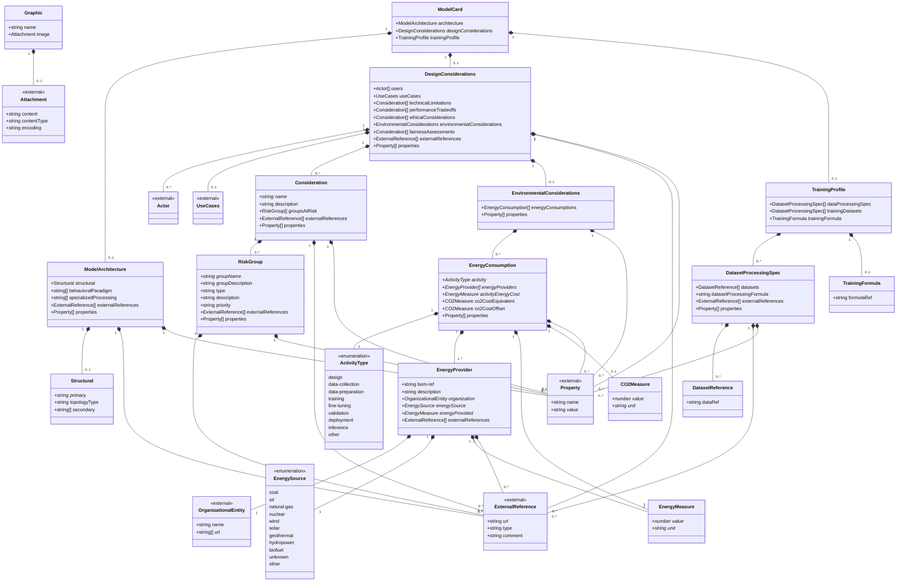

# CycloneDX AI/ML Schema 2.0 - UML Diagrams

## Mermaid Class Diagram

## Key Components

### ModelCard
The root object containing architecture, design considerations, and training profile information for AI/ML models.

### ModelArchitecture
Describes the structural and behavioral aspects of the model:
- **Structural**: Primary architecture (e.g., Transformer, CNN, RNN), topology type, and secondary components
- **Behavioral Paradigm**: Learning approaches (e.g., Autoregressive, Diffusion, Contrastive)
- **Specialized Processing**: Custom mechanisms (e.g., RoPE, FlashAttention-2)

### DesignConsiderations
Captures various considerations for model design and deployment:
- **Users**: Intended users of the model
- **Use Cases**: Intended applications
- **Technical Limitations**: Mathematical and physical constraints
- **Performance Tradeoffs**: Known accuracy/performance tradeoffs
- **Ethical Considerations**: Ethical risks
- **Environmental Considerations**: Environmental impact metrics
- **Fairness Assessments**: Fairness evaluations

### TrainingProfile
Information about training data and methodology:
- **Data Processing Spec**: Array of data processing specifications
- **Training Datasets**: Dataset processing specifications for training
- **Training Formula**: Reference to the training formula defined elsewhere in the BOM

### EnvironmentalConsiderations
Tracks environmental impact through:
- **Energy Consumption**: Energy used across lifecycle activities
- **Energy Providers**: Organizations providing energy with source information
- **CO2 Metrics**: Carbon dioxide equivalent measurements

### Risk Management
- **Consideration**: Named considerations with descriptions and affected risk groups
- **RiskGroup**: Groups at risk with domain information from risk schema

## Notes

- Fields marked with `*` are required
- `<<external>>` indicates types defined in other CycloneDX schemas
- Enumerations show allowed values for specific fields
- Cardinality notation: `1` (exactly one), `0..1` (optional), `0..*` (zero or more), `1..*` (one or more)